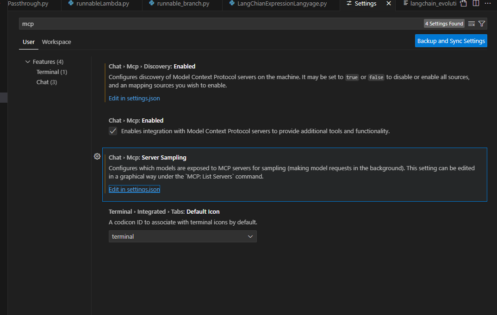
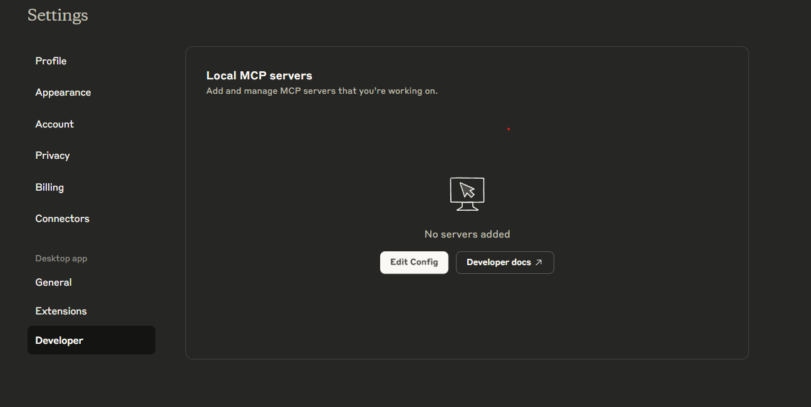
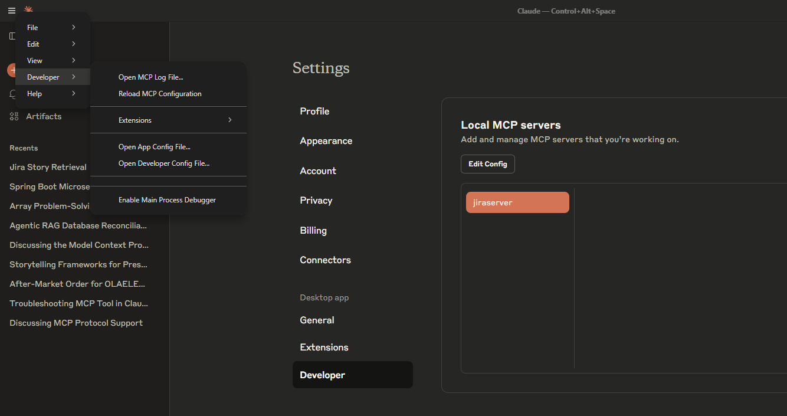

# Jira MCP Server Setup Guide

## Overview

This project provides a Model Context Protocol (MCP) server that enables AI assistants (like GitHub Copilot, Claude, etc.) to interact with Jira through natural language commands. The server acts as a bridge between your IDE and Jira's REST API, allowing you to create, update, and manage Jira issues directly from your development environment.

## Prerequisites

Before setting up the Jira MCP server, ensure you have:


1. **Node.js and Bun**: The project uses Bun as the runtime
   
   **macOS Installation:**
   ```bash
   # Using curl (recommended)
   curl -fsSL https://bun.sh/install | bash
   
   # Using Homebrew
   brew tap oven-sh/bun
   brew install bun
   
   # Using npm
   npm install -g bun

   #For refernce visit officla website 
    Download from: https://bun.sh/
   ```

   
   **Windows Installation:**
   ```bash
   # Using PowerShell (recommended)
   powershell -c "irm bun.sh/install.ps1 | iex"
   
   # Using Chocolatey
   choco install bun
   
   # Manual installation
   Download from: https://bun.sh/
   ```
   
   
   **Verify Installation:**
   ```bash
    bun --version

    # Check current version
    bun --version

    # Update to latest version
    bun upgrade

    # Or install a specific version
    bun install -g bun@latest
```


2. **Jira Account**: You need access to a Jira instance
   - Atlassian Cloud account, vist below given link and create account 
   - https://id.atlassian.com/login

3. **Jira API Token**: Generate an API token for authentication
   - Go to https://id.atlassian.com/manage-profile/security/api-tokens
   - Create a new API token
   - Save the token securely

## Installation

### Step 1: Clone the Repository

```bash
git clone <your-repository-url>
cd automateJira
```

### Step 2: Install Dependencies

```bash
bun install
```

### Step 3: Configure Jira Credentials

The server is currently configured with hardcoded credentials in `index.ts`.  you should move these to environment variables:

1. **Option A: Environment Variables (Recommended)**
   
   Create a `.env` file in the project root:
   ```bash
   # .env
   JIRA_BASE_URL=https://your-domain.atlassian.net
   JIRA_EMAIL=your-email@example.com
   JIRA_API_TOKEN=your-api-token-here
   ```

   Then update `index.ts` to use environment variables:
   ```typescript
   import dotenv from "dotenv";
   dotenv.config();

   const JIRA_CONFIG: JiraConfig = {
     baseUrl: process.env.JIRA_BASE_URL || '',
     email: process.env.JIRA_EMAIL || '',
     apiToken: process.env.JIRA_API_TOKEN || ''
   };
   ```

2. **Option B: Direct Configuration (Development Only)**
   
   Update the `JIRA_CONFIG` object in `index.ts`:
   ```typescript
   const JIRA_CONFIG: JiraConfig = {
     baseUrl: 'https://your-domain.atlassian.net',
     email: 'your-email@example.com',
     apiToken: 'your-api-token-here'
   };
   ```

### Step 4: Test the Installation

```bash
bun run start
```


If everything is configured correctly, you should see:
```
Jira MCP server running on stdio
```

## Configuration

### MCP Server Configuration

The server is configured through the `package.json` file:

```json
{
  "mcp": {
    "name": "jira-mcp",
    "version": "1.0.0",
    "description": "Jira automation MCP server",
    "transport": "stdio",
    "command": ["bun", "run", "start"]
  }
}
```

### Available Tools

The server provides the following tools:

1. **create_jira_issue**: Create new Jira issues
2. **get_jira_issue**: Get details of existing issues
3. **search_jira_issues**: Search using JQL queries
4. **get_jira_projects**: List available projects
5. **update_jira_issue**: Update issue fields
6. **add_jira_comment**: Add comments to issues
7. **transition_jira_issue**: Change issue status

## Usage

### Integration with AI Assistants

#### VSCODE

1. Go to setting and then serach MCP then edit settings.json file :
   ```json
    "mcpServers": {
        "jiraserver": {
        "command": "C:\\Path\\To your bun \\.bun\\bin\\bun.exe",
        "args": ["C:\\Path\\To\\Your\\index.ts"]
        }
    }
   ```
   

2. Restart your IDE/editor

#### Claude Desktop

1. **Enable Developer Options:**
   - Open Claude Desktop
   - Go to **Files** → **Developer**
   - Enable **Developer Options**

2. **Edit Configuration:**
   - Click **Edit Config** in the Developer menu
   - This will open the `claude_desktop_config.json` file

3. **Add MCP Server Configuration:**
   Add the following configuration to your `claude_desktop_config.json` file:
   ```json
   {
     "mcpServers": {
       "jiraserver": {
         "command": "C:\\Path\\To\\Your\\.bun\\bin\\bun.exe",
         "args": ["C:\\Path\\To\\Your\\Project\\index.ts"]
       }
     }
   }
   ```

    

    


4. **Save and Restart:**
   - Save the `claude_desktop_config.json` file
   - Restart Claude Desktop
   - The Jira MCP server should now be available in Claude

**Finding Your Paths:**

**To find your Bun executable path:**
```bash
# On Windows
where bun

# On macOS/Linux
which bun
```


**Alternative Configuration (if the above doesn't work):**
```json
{
  "mcpServers": {
    "jiraserver": {
      "command": "bun",
      "args": ["run", "start"],
      "cwd": "C:\\Path\\To\\Your\\Project"
    }
  }
}
```

### Example Commands

Once integrated, you can use natural language commands like:

- "Create a new bug report for the login issue"
- "Get details of issue PROJ-123"
- "Search for all open issues in the PROJ project"
- "Add a comment to issue PROJ-123"
- "Move issue PROJ-123 to In Progress status"
- "Update the priority of issue PROJ-123 to High"

### Tool Parameters

#### create_jira_issue
- `projectKey` (required): The project key (e.g., 'PROJ')
- `issueType` (required): Issue type (e.g., 'Bug', 'Task', 'Story')
- `summary` (required): Brief summary/title of the issue
- `description` (optional): Detailed description
- `priority` (optional): Priority level (e.g., 'High', 'Medium', 'Low')
- `assignee` (optional): Email or username of assignee
- `epicKey` (optional): Key of the epic to link this issue to
- `epicName` (optional): Name of the epic (required only for Epic issue type)

#### get_jira_issue
- `issueKey` (required): The issue key (e.g., 'PROJ-123')

#### search_jira_issues
- `jql` (required): JQL query string (e.g., 'project = PROJ AND status = Open')
- `maxResults` (optional): Maximum number of results to return (default: 20)

#### update_jira_issue
- `issueKey` (required): The issue key (e.g., 'PROJ-123')
- `summary` (optional): New summary/title
- `description` (optional): New description
- `priority` (optional): New priority level
- `assignee` (optional): New assignee email or username
- `epicKey` (optional): Key of the epic to link this issue to
- `status` (optional): New status to transition to

#### add_jira_comment
- `issueKey` (required): The issue key (e.g., 'PROJ-123')
- `comment` (required): Comment text

#### transition_jira_issue
- `issueKey` (required): The issue key (e.g., 'PROJ-123')
- `transitionName` (required): Name of the transition (e.g., 'In Progress', 'Done')


### Adding New Tools

To add a new tool:

1. Define the tool schema in the `setupToolHandlers()` method
2. Add a case in the switch statement in the `CallToolRequestSchema` handler
3. Implement the tool method
4. Update the tool list in `ListToolsRequestSchema`

Example:
```typescript
// Add to tools array
{
  name: "your_new_tool",
  description: "Description of your tool",
  inputSchema: {
    type: "object",
    properties: {
      // Define your parameters
    },
    required: ["required_param"]
  }
}

// Add to switch statement
case "your_new_tool":
  return await this.yourNewTool(args);

// Implement the method
async yourNewTool(args: YourArgsType) {
  // Implementation
}
```

## Troubleshooting

### Common Issues

#### 1. Authentication Errors
**Symptoms**: "Jira API error: 401 Unauthorized"
**Solution**: 
- Verify your API token is correct
- Ensure your email is associated with the Jira instance
- Check that your account has the necessary permissions

#### 2. Project Not Found
**Symptoms**: "Project 'PROJ' not found"
**Solution**:
- Verify the project key exists in your Jira instance
- Ensure your account has access to the project
- Use `get_jira_projects` to list available projects

#### 3. Issue Type Not Found
**Symptoms**: "Issue type 'CustomType' not found"
**Solution**:
- Check available issue types in your Jira project
- Use standard issue types: 'Bug', 'Task', 'Story', 'Epic'

#### 4. Transition Not Available
**Symptoms**: "Transition 'CustomStatus' not found"
**Solution**:
- Check available transitions for the issue
- Use standard transitions: 'To Do', 'In Progress', 'Done'

#### 5. Server Won't Start
**Symptoms**: "Cannot find module" or other startup errors
**Solution**:
- Ensure all dependencies are installed: `bun install`
- Check that Bun is properly installed
- Verify TypeScript configuration

#### 6. Bun Installation Issues
**Symptoms**: "bun: command not found" or installation errors
**Solution**:
- **macOS**: Ensure you have Xcode Command Line Tools installed: `xcode-select --install`
- **Windows**: Make sure PowerShell execution policy allows scripts: `Set-ExecutionPolicy -ExecutionPolicy RemoteSigned -Scope CurrentUser`
- **Linux**: Ensure you have curl installed: `sudo apt-get install curl` (Ubuntu/Debian) or `sudo yum install curl` (CentOS/RHEL)
- **All platforms**: Try restarting your terminal after installation
- **Alternative**: Use Node.js with npm instead: `npm install -g bun`

#### 7. Claude Desktop Configuration Issues
**Symptoms**: "MCP server not found" or "Failed to start server"
**Solution**:
- **Check Developer Options**: Ensure Developer Options are enabled in Claude Desktop
- **Verify JSON Syntax**: Make sure your `claude_desktop_config.json` has valid JSON syntax
- **Check Paths**: Verify that the Bun executable and project paths are correct
- **Use Absolute Paths**: Always use absolute paths, not relative paths
- **Restart Claude**: After making changes, completely restart Claude Desktop
- **Check Permissions**: Ensure Claude has permission to execute the Bun executable
- **Alternative Setup**: Try using the `cwd` (current working directory) approach instead of full paths

### Debug Mode

Enable debug logging by adding console.log statements or using a debugger:

```bash
# Run with Node.js debugger
bun --inspect run index.ts
```


