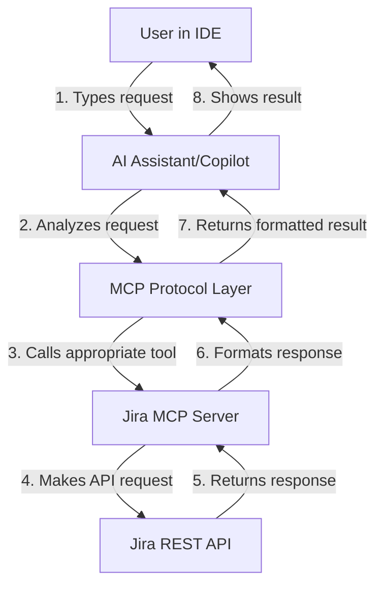
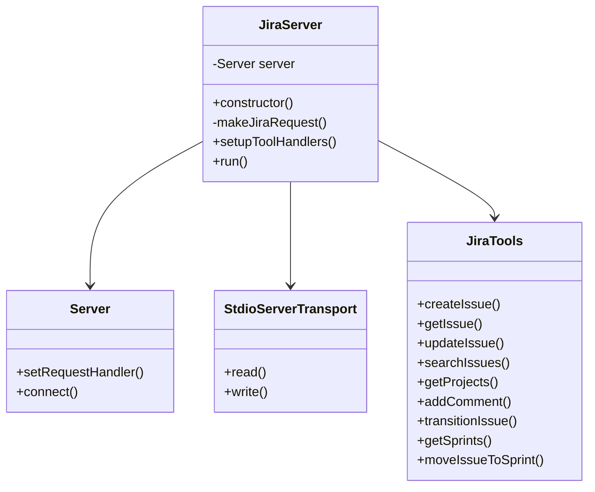
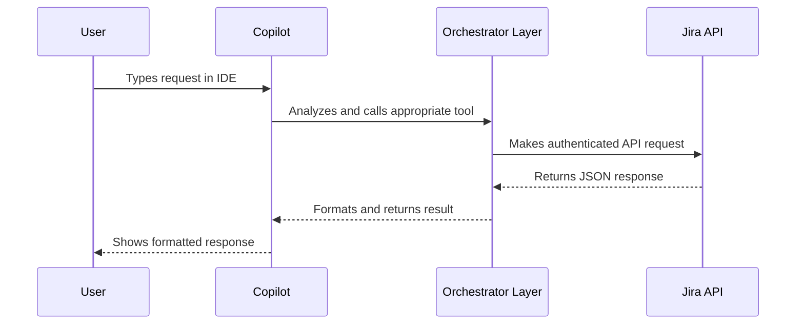

# Jira MCP Server Architecture Overview

## System Architecture

The Jira MCP (Model Context Protocol) Server acts as a bridge between AI assistants (like GitHub Copilot) and Jira's REST API. Here's how the system works:



## Component Architecture



## Request Flow



## Tool Registration Flow


## Detailed Architecture Explanation

### 1. User Interaction Layer
- Users interact with the system through their IDE (like VS Code or Cursor)
- They type natural language requests that are intercepted by the AI assistant
- The AI assistant analyzes the request and determines which MCP tool to use

### 2. MCP Protocol Layer
- Defined in `.mcp.json`
- Registers available tools and their schemas
- Handles request/response formatting
- Manages tool validation and execution

### 3. Jira MCP Server Layer
- Core server implementation in `index.ts`
- Handles authentication and request management
- Implements tool handlers for each Jira operation
- Manages error handling and response formatting

### 4. Jira API Integration Layer
- Makes authenticated requests to Jira's REST API
- Handles different API versions (v3 and Agile)
- Manages response parsing and error handling
- Implements retry logic and rate limiting

## Key Components

### 1. Tool Handlers
```typescript
interface ToolHandler {
    name: string;
    description: string;
    inputSchema: {
        type: string;
        properties: object;
        required: string[];
    };
}
```

### 2. Request Flow
```typescript
async function handleRequest(request) {
    // 1. Validate request
    // 2. Extract parameters
    // 3. Call appropriate handler
    // 4. Format response
    // 5. Return result
}
```

### 3. Response Format
```typescript
interface Response {
    content: Array<{
        type: string;
        text: string;
    }>;
}
```

## Implementation Details

### 1. Authentication
- Uses Basic Auth with email and API token
- Credentials stored in environment variables
- Token refreshed automatically when needed

### 2. Error Handling
- Comprehensive error catching and formatting
- Detailed error messages for debugging
- Graceful fallbacks for API issues

### 3. Response Formatting
- Consistent formatting across all tools
- Emoji usage for better readability
- Markdown support for rich text

## Usage Example

When a user types a request like "move SCRUM-11 to Sprint 1", the following happens:

1. Copilot analyzes the request and determines it needs to:
   - Verify the issue exists
   - Get sprint information
   - Move the issue to the sprint
   - Verify the move was successful

2. The MCP server:
   - Receives the tool calls
   - Validates the parameters
   - Makes the necessary API requests
   - Returns formatted responses

3. The user sees:
   - Confirmation of each step
   - Any errors or warnings
   - Final success message

## Security Considerations

1. Authentication
   - API tokens used instead of passwords
   - Tokens stored securely
   - No token exposure in logs

2. Request Validation
   - Input sanitization
   - Parameter validation
   - Rate limiting

3. Error Handling
   - No sensitive data in errors
   - Graceful failure handling
   - Detailed logging

## Future Enhancements

1. Performance
   - Request caching
   - Batch operations
   - Connection pooling

2. Features
   - Webhook support
   - Real-time updates
   - Custom field handling

3. Integration
   - Multiple Jira instances
   - Other issue trackers
   - CI/CD integration 