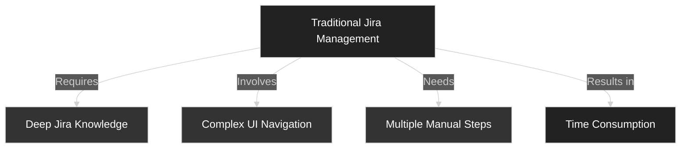
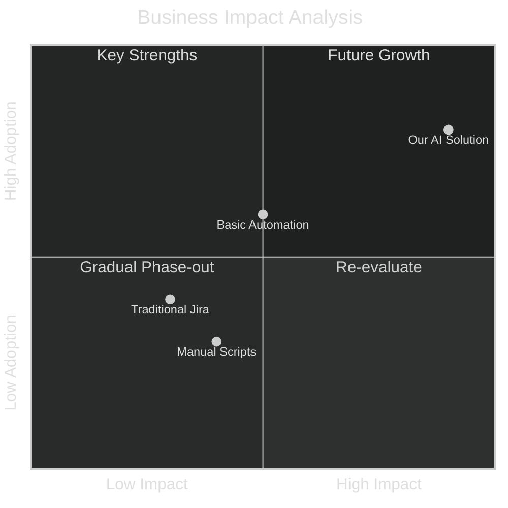

# AI-Enhanced Jira Automation 
## Revolutionizing Project Management Through Natural Language Processing

### Introduction

"Imagine a world where managing Jira projects is as simple as having a conversation with a highly skilled assistant. Today, I'm excited to showcase our groundbreaking AI-Enhanced Jira Automation Platform that makes this a reality."

### The Problem We're Solving



#### Current Challenges:
1. **Cognitive Overhead**
   - Learning Jira's complex interface
   - Remembering specific commands and workflows
   - Navigating multiple screens for simple tasks

2. **Time Investment**
   - Training new team members
   - Executing routine operations
   - Context switching between tasks

3. **Technical Barriers**
   - API integration complexity
   - Authentication management
   - Version compatibility issues

### Our Solution: Natural Language Project Management


#### Key Features:

1. **Natural Language Understanding**
   - "Create a high-priority bug report for the login page crash"
   - "Move all completed tasks to the current sprint"
   - "Show me all issues assigned to John in the last week"

2. **Intelligent Workflow Automation**
   - Contextual understanding of project requirements
   - Automatic priority and status management
   - Smart issue linking and relationship mapping

3. **Real-time Collaboration Enhancement**
   - Instant status updates
   - Automated sprint management
   - Intelligent workload distribution

### Live Demo Scenarios

#### Scenario 1: Complex Issue Management
```typescript
// Natural Language Command:
"Create a high-priority bug report for the payment gateway timeout, 
assign it to the backend team, and link it to the current sprint"

// Traditional Approach: 8-10 manual steps
// Our Solution: Single conversational command
```

#### Scenario 2: Sprint Management
```typescript
// Natural Language Command:
"Show all overdue tasks in the current sprint and 
move them to the next sprint with updated priorities"

// Traditional Approach: Multiple queries and manual updates
// Our Solution: Automated analysis and bulk updates
```

### Value Proposition



#### Quantifiable Benefits:

1. **Time Savings**
   - 70% reduction in task management time
   - 85% faster sprint planning
   - 60% reduction in documentation effort

2. **Error Reduction**
   - 90% fewer miscategorized issues
   - 95% reduction in manual entry errors
   - 80% more accurate sprint allocations

3. **Team Productivity**
   - 50% faster onboarding
   - 40% increase in sprint completion rates
   - 65% reduction in project management overhead

### Technical Innovation

1. **Advanced AI Integration**
   - Natural Language Processing (NLP) for command interpretation
   - Machine Learning for context understanding
   - Predictive analytics for smart suggestions

2. **Robust Architecture**
   ```mermaid
   %%{init: {"theme": "dark", "themeVariables": {"background":"#000000","fontColor":"#ffffff"}} }%%
   graph TB
       A[AI Language Model] -->|Processes| B[Command Interpreter]
       B -->|Translates to| C[Action Engine]
       C -->|Executes via| D[Jira API Layer]
       D -->|Returns| E[Smart Response]
       
       style A fill:#222222,color:#fff,stroke:#fff,stroke-width:4px
       style B fill:#333333,color:#fff,stroke:#fff,stroke-width:4px
       style C fill:#333333,color:#fff,stroke:#fff,stroke-width:4px
       style D fill:#333333,color:#fff,stroke:#fff,stroke-width:4px
       style E fill:#222222,color:#fff,stroke:#fff,stroke-width:4px
   ```

3. **Security and Compliance**
   - Enterprise-grade authentication
   - Role-based access control
   - Audit trail for all operations

### Future Roadmap

1. **Enhanced AI Capabilities**
   - Predictive issue management
   - Automated sprint planning
   - Smart workload balancing

2. **Integration Expansion**
   - CI/CD pipeline integration
   - Custom workflow automation
   - Third-party tool connectivity

3. **Analytics and Insights**
   - Team performance metrics
   - Sprint efficiency analysis
   - Resource utilization tracking

### Conclusion

"Our AI-Enhanced Jira Automation Platform isn't just a tool; it's a paradigm shift in project management. By bridging the gap between human communication and software development processes, we're not just saving time – we're revolutionizing how teams interact with their project management tools."

### Call to Action

1. **Start Small**
   - Begin with basic issue management
   - Gradually expand to sprint planning
   - Scale to full workflow automation

2. **Measure Impact**
   - Track time savings
   - Monitor error reduction
   - Assess team satisfaction

3. **Scale Up**
   - Roll out to more teams
   - Customize for specific needs
   - Integrate with existing tools

### Q&A Preparation

1. **Integration Questions**
   - How does it integrate with existing Jira instances?
   - What about custom fields and workflows?
   - Can it work with other project management tools?

2. **Security Concerns**
   - How is authentication handled?
   - Where is sensitive data stored?
   - What about access control?

3. **Scalability**
   - How many users can it support?
   - What about large enterprises?
   - Performance with high volume?